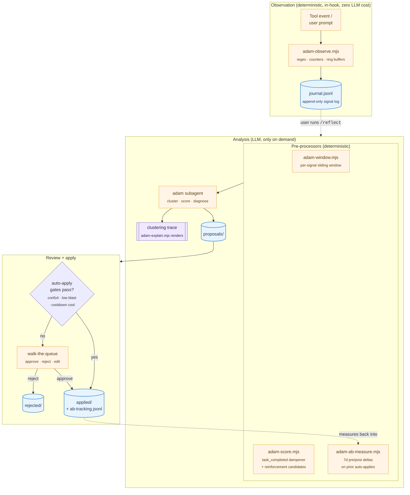

<div align="center">

<picture>
  <source media="(prefers-color-scheme: dark)" srcset="./assets/logo-dark.svg">
  
</picture>

# claude-adam

**A self-improvement layer for [Claude Code](https://claude.com/claude-code).**

Watches the friction in your coding sessions, clusters the signals via an LLM analyst, and proposes targeted improvements — new skills, memory entries, agent edits — that you review and apply.

[](LICENSE)
[](https://github.com/lukaszraczylo/claude-adam/releases)
[](./adam/tests/run-tests.sh)
[](https://nodejs.org)
[]()

</div>

---

## The story behind Adam

Adam is my newborn son.

Watching him over the last few months — the way he observes the world, tries something, watches what happens, adjusts, and tries again — I realised that the most powerful learning loop in nature is also one of the simplest. No grand theory. No instruction manual. Just relentless feedback and pattern recognition, applied to every waking moment.

LLMs can learn the same way. Give them a hook into the real friction of your work — the corrections, the dead-ends, the moments you say *"no, try again"* — and let them propose improvements grounded in **what actually happened**. Not what they assume might help. What you actually struggled with.

**claude-adam** is that loop, wired into Claude Code. It's named after Adam because the methodology is his.

---

## Highlights

- 🔍 **Zero LLM cost at observation time.** Deterministic regex + counter detection in a Node hook. The analyst only runs when you invoke `/reflect`.
- 📡 **11 signal types.** Friction (`correction`, `tool_error_loop`, `dead_end`, `edit_churn`, …) + reinforcement (`task_completed`, `correction_free_streak`, `clean_recovery`) + meta.
- 🛡️ **Tight auto-apply gates.** Confidence ≥ 4, cross-session evidence, contradiction veto, per-(skill, fingerprint) cooldown. Most things queue for your manual review.
- 📊 **A/B effectiveness measurement.** Every auto-applied edit gets a 7-day pre/post signal-count delta. If a proposed fix made things worse, the next `/reflect` says so.
- ⏳ **Per-signal sliding windows.** Stale friction doesn't accumulate forever. `dead_end` 7d, `correction` 30d, reinforcement signals 60d.
- 🔬 **Observable.** Every clustering decision (passed / threshold-blocked / window-filtered / contradiction-vetoed) emits a trace. `/reflect --explain` shows it.
- 📦 **Pure Node.** Zero npm dependencies. Runs on macOS and Linux (Alpine smoke-tested).

## Quick start

```sh
curl -fsSL https://raw.githubusercontent.com/lukaszraczylo/claude-adam/main/install.sh | bash
```

The installer copies files into `~/.claude/`, offers to merge ADAM's hook entries into `~/.claude/settings.json` (with a diff preview and `[y/N]` confirm), and preserves any local edits via `.adam-new` sidecar files. Pass `--yes` to skip prompts, `--dry-run` to preview.

Then:

```sh
bash ~/.claude/adam/tests/run-tests.sh   # expect: 87 passed, 0 failed
# … start a fresh Claude Code session …
/reflect                                  # walks the proposal queue
/reflect --explain                        # also shows the analyst's clustering trace
```

Pin a release for reproducibility:

```sh
curl -fsSL https://raw.githubusercontent.com/lukaszraczylo/claude-adam/v0.3.3/install.sh \
  | VERSION=v0.3.3 bash
```

## How it works



The observation layer is a 350-line Node hook. Pure regex, counters, ring buffers — no LLM in the hot path. Signals append one JSONL line per detection to `~/.claude/adam/journal.jsonl`.

The analysis layer is an LLM subagent invoked by `/reflect`. Before the analyst runs, three deterministic pre-processors filter and enrich the journal: `adam-window.mjs` drops stale entries per per-signal age, `adam-score.mjs` computes per-session urgency dampeners + reinforcement candidates, and `adam-ab-measure.mjs` checks whether previously auto-applied edits actually reduced their originating signal.

The analyst clusters signals, scores them against a deterministic rubric (see below), and emits proposal markdown files to `~/.claude/adam/proposals/`. Each proposal carries a `# Diagnosis` block (Trigger / Action / Mismatch / Outcome with a verbatim transcript quote), a `# Success criterion`, and the source journal-entry timestamps it clustered.

Auto-apply runs only for low-blast types (memory entries, new skills, ephemeral nudges, reinforcement logs) backed by cross-session evidence. Everything else queues for your manual approve / reject / edit walk.

## Signals

| Signal | Trigger | Window* |
|---|---|---|
| `correction` | Strong tokens (`stop`, `wrong`, `undo`, …) OR weak tokens (`no`, `actually`, `wait`) with negation/contrast nearby | 30d |
| `retry_loop` | Same tool + same args called 3× in a 10-event window | 14d |
| `weak_agent` | Same subagent dispatched 2× in last 5 tool calls | 30d |
| `tool_error_loop` | Same error fingerprint 3× in a 5-event ring (fingerprints normalised — `ECONNREFUSED` and `"Connection refused"` cluster) | 30d |
| `dead_end` | 8 PostToolUse events without a UserPromptSubmit between them | 7d |
| `edit_churn` | Same file edited 4× in a window | 14d |
| `build_loop` | 2× build/test/compile commands fail in same session | 30d |
| `subagent_dispatch_pattern` | Same subagent dispatched ≥ 3× cumulatively | 30d |
| `correction_free_streak` | 5 clean UserPromptSubmits in a row — reinforcement input | 60d |
| `clean_recovery` | 3 clean PostToolUse events after a struggle signal — reinforcement input | 60d |
| `task_completed` | 5 tools / 3 kinds / 0 corrections — fed into the urgency dampener + reinforcement candidates | 60d |

\* Per-signal sliding window for `/reflect` analysis. See `SIGNAL_WINDOWS_DAYS` in `adam/scripts/adam-window.mjs`.

Detection is local, regex-based, zero LLM cost. Signals append to `~/.claude/adam/journal.jsonl`.

## Auto-apply rubric

```
Sum:
+2  Signal repeated ≥ 3× across ≥ 2 sessions (within signal's window)
+2  Struggle signal appearing ≥ 1× within a single session (does not stack)
+2  Transcript contains positive endorsement near related action
+1  Multi-axis cluster (≥ 2 distinct struggle types in same session)
-1  Type-bias penalty (≥ 3 rejections, applied:rejected < 1:2)
+1  Blast radius low (memory or new isolated skill)
 0  Blast radius medium (new agent, new hook, edit existing skill)
-1  Blast radius high (CLAUDE.md, settings hooks, edit agent, deletion)
+1  Surgical (one file, ≤ 50 LOC for non-skill_new; ≤ 80 LOC for skill_new)
-3  Touches deny-list (settings.json hooks/permissions, CLAUDE.md, deletions)
```

Modifiers applied at scoring time:

- × `dampener` from `adam-score.mjs` (0.5 / 0.75 / 1.0 based on session's `task_completed` count) — sessions that net-succeeded score lower urgency.

`auto_apply_eligible` requires **all** of:

- `confidence ≥ 4`
- `blast_radius == low`
- `type ∈ {memory, skill_new, nudge, reinforcement}` (or `skill_edit` via the win-driven gate)
- `cross_session_evidence == true` (except `nudge`, which is single-session by design)
- `adam-cooldown.mjs` returns `cool` for `(target_skill, proposal_fingerprint)`
- `contradiction_flag` unset

`skill_edit` additionally requires:

- Win-signal evidence (`correction_free_streak` / `clean_recovery` cites target skill)
- Diff is append-only, ≤ 30 LOC, resulting size ≤ 2× original
- No auto-edit to same target in past 7 days (per-fingerprint cooldown)
- No rejection-blacklist on target in past 30 days
- `# Diagnosis` section present + structurally valid

Everything else queues.

## Lifecycle: from signal to permanent improvement

Every proposal records the journal entry timestamps that fed its cluster (`source_entries` in frontmatter). When you apply or reject a proposal, the skill calls `adam-archive.mjs` which moves matching entries from `journal.jsonl` to `journal/actioned-<id>.jsonl`. The result:

- `journal.jsonl` stays bounded by **active** observations only.
- The next `/reflect` reads `applied/` + `rejected/` frontmatter, builds an excluded-timestamps set, and skips any leftover journal entries that were already actioned.
- Rule changes (e.g. lowering a threshold) immediately re-evaluate the remaining active observations — no manual cursor rewind needed.

Auto-applied proposals additionally append to `~/.claude/adam/ab-tracking.jsonl`. The next time `/reflect` runs (and 7+ days have passed), `adam-ab-measure.mjs` computes a pre/post delta of the originating signal count. Status: `improved` / `neutral` / `regressed` / `no_baseline` / `pending`. Regressions surface at the top of the analyst's output so a bad fix doesn't quietly persist.

## Inspecting the analyst's reasoning

Every `/reflect` run also writes the analyst's clustering trace to `~/.claude/adam/last-trace.txt`. The trace records, per cluster: signal type, occurrence count, sessions, which gates passed or failed, and whether the cluster produced a proposal or was skipped (with reason: `threshold` / `cross_session` / `window` / `contradiction` / `other`).

```sh
node ~/.claude/adam/scripts/adam-explain.mjs --mode summary   # SUMMARY + per-decision counts
node ~/.claude/adam/scripts/adam-explain.mjs --mode full      # verbatim trace + rejection histogram
node ~/.claude/adam/scripts/adam-explain.mjs --mode json      # machine-readable
```

Or pass `--explain` to `/reflect` to render the full trace inline.

## What it will not do

- 🚫 No background LLM spend. The analyst runs only when you invoke `/reflect`.
- 🚫 No retroactive transcript mining beyond the journal.
- 🚫 No hard `rm` of any artifact. Deletions are soft (`mv` to `trash/<ts>/`).
- 🚫 No autonomous edits to `CLAUDE.md`, agents, hooks, or `settings.json` — these always queue for review regardless of confidence.
- 🚫 No proposal that matches a previously-rejected idea (≥ 2 token overlap with rejection's `# Why`).
- 🚫 No invented trigger phrases for new skills — every trigger comes from observed user input.

## Layout

```
~/.claude/
├── hooks/
│   ├── adam-observe.mjs              # signal collector (UserPromptSubmit / PreToolUse / PostToolUse)
│   └── adam-nudge.mjs                # SessionStart reminder + pending-upgrade warning
├── agents/adam.md                    # analyst subagent (system prompt + rubric)
├── skills/adam-self-improvement/
│   └── SKILL.md                      # /reflect protocol
├── commands/reflect.md               # /reflect slash command
└── adam/
    ├── journal.jsonl                 # active observations
    ├── journal/                      # rotated weekly (YYYY-Www.jsonl) + actioned-<id>.jsonl
    ├── state.json                    # per-session counters
    ├── usage.json                    # invocation tallies + visibility metrics
    ├── active-nudges.json            # ephemeral SessionStart reminders (auto-expire)
    ├── ab-tracking.jsonl             # one entry per auto-apply, drives effectiveness measurement
    ├── reinforcements.jsonl          # appended on reinforcement proposal apply
    ├── last-trace.txt                # most recent analyst clustering trace
    ├── proposals/                    # queued, awaiting review
    ├── applied/                      # approved + auto-applied archive
    ├── rejected/                     # rejected with reason
    ├── trash/                        # soft-deleted artifacts (recoverable)
    ├── scripts/
    │   ├── adam-utils.mjs                  # shared journal-reading + frontmatter parsing
    │   ├── adam-window.mjs                 # per-signal sliding-window filter
    │   ├── adam-score.mjs                  # urgency dampener + reinforcement candidates
    │   ├── adam-ab-measure.mjs             # 7d pre/post delta per auto-applied edit
    │   ├── adam-cooldown.mjs               # per-(skill, fingerprint) cooldown gate
    │   ├── adam-nudge-eligibility.mjs      # dead_end session-count check
    │   ├── adam-explain.mjs                # clustering trace parser/renderer
    │   ├── adam-apply-reinforcement.mjs    # reinforcement proposal apply
    │   ├── adam-upgrade.mjs                # .adam-new file UX (list/diff/accept)
    │   └── adam-archive.mjs                # post-apply journal cleanup
    └── tests/run-tests.sh            # 87 isolated tests; never touches live state
```

## What's new

- **v0.3.3** — analyst observability, A/B measurement, journal hygiene. ISO-week journal rotation replaces 5MB size-based (fixes silent cluster-straddling under-count); per-signal sliding windows via `adam-window.mjs`; error fingerprint normalisation; correction corpus expanded + weak-token co-occurrence requirement (kills the `"actually, I think..."` false positive); mandatory clustering trace + `adam-explain.mjs`; new `nudge` and `reinforcement` proposal types; per-(skill, fingerprint) cooldown via `adam-cooldown.mjs`; `task_completed` scoring (dampener + reinforcement); A/B effectiveness measurement; upgrade UX overhaul (`adam-upgrade.mjs --list/--diff/--accept`); shared `adam-utils.mjs`. 87 tests (up from 30).
- **v0.3.2** — `task_completed` signal: post-task skill capture for downstream reinforcement scoring (consumed in v0.3.3).
- **v0.3.1** — code review pass: bug fixes (`errorFingerprint` no longer false-positives on `is_error: false`, archive script handles same-millisecond duplicates correctly, `tool_window` clears on session change, nudge filters proposal filenames by pattern), prose conciseness cuts, hardened `install.sh` with curl one-liner + settings.json merge, `adam-uninstall.sh`, isolated test harness.
- **v0.3.0** — causal diagnosis: every proposal carries a `# Diagnosis` block (Trigger/Action/Mismatch/Outcome with verbatim transcript quote), plus `contradiction_flag` heuristic that vetoes auto-apply on obviously-conflicting `skill_edit` additions.
- **v0.2.1** — win signals (`correction_free_streak`, `clean_recovery`) feed `skill_edit` auto-apply under a strict gate (≤ 30 LOC, ≤ 2× byte cap, 7d cooldown, 30d blacklist).
- **v0.2.0** — actioned-entry archival via `adam-archive.mjs`; `cursor` field deprecated.

## Requirements

- **Claude Code v2.1.0+** — for auto skill hot-reload (older versions need a session restart after `skill_new` proposals).
- **Node.js 18+** — tested on v22, used by the hook + helper scripts. Zero npm dependencies.
- **Bash 4+**, `git`, `curl`, `jq` — for the installer + test harness.

### Platform support

Tested on **macOS** (Darwin / BSD coreutils) and **Linux** (Alpine, glibc + musl). The install / uninstall / test scripts are written to be portable: `stat` uses BSD `-f` with GNU `-c` fallback, `mktemp -d -t prefix.XXXXXX` works on both, no GNU-only flags. CI smoke verified under `alpine:latest`.

## Uninstall

One-shot:

```sh
curl -fsSL https://raw.githubusercontent.com/lukaszraczylo/claude-adam/main/adam-uninstall.sh | bash
```

The uninstaller archives `~/.claude/adam/` to `~/.claude/adam.bak.<ts>/` (preserving your journal/proposals data), removes ADAM files, and offers to strip ADAM hook entries from `~/.claude/settings.json` with a diff prompt. Pass `--yes` to skip the prompt; `--purge` to delete the data archive instead of preserving it.

Manual:

```sh
mv ~/.claude/adam ~/.claude/adam.bak.$(date +%s)
rm -f ~/.claude/hooks/adam-*.mjs ~/.claude/agents/adam.md ~/.claude/commands/reflect.md
rm -rf ~/.claude/skills/adam-self-improvement
```

Then remove the four `adam-*` hook entries from `~/.claude/settings.json`.

## Contributing

Issues and PRs welcome — especially additional signal types, transcript-aware diagnosis improvements, and platform fixes. Run the test suite before opening a PR:

```sh
bash ~/.claude/adam/tests/run-tests.sh
```

## License

[MIT](LICENSE) — © 2026 Lukasz Raczylo

---

<div align="center">
<sub>Named after my son Adam, who taught me that observation is the start of every interesting thing.</sub>
</div>
